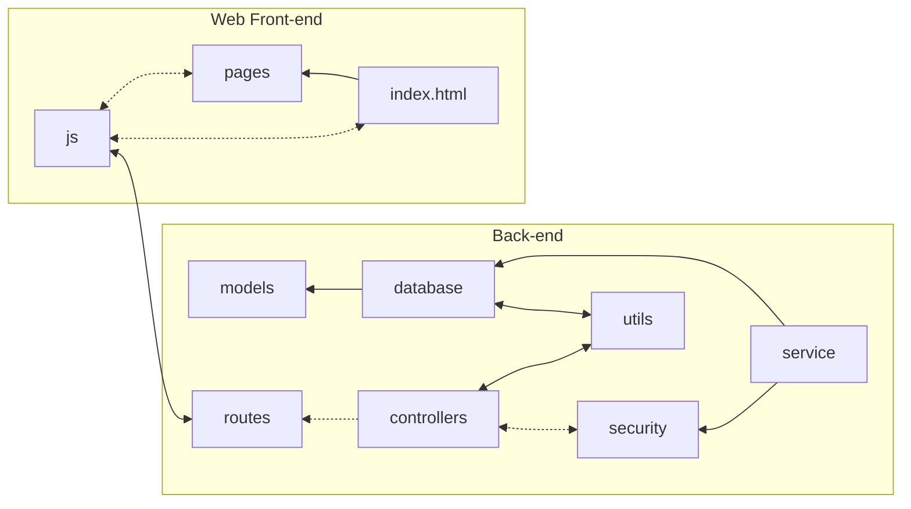

# authentication-and-authorisation-with-expressjs

								flowchart RL

```mermaid
flowchart RL
  subgraph g1[Back-end]
    service --> database
    service --> security
    security <-.-> controllers
    utils <--> database --> models
    utils <--> controllers
    controllers .-> routes
  end
  subgraph f1[Web Front-end]
    index.html --> pages
    pages <-.-> js
    index.html <-.-> js
  end
  routes <--> js


```
